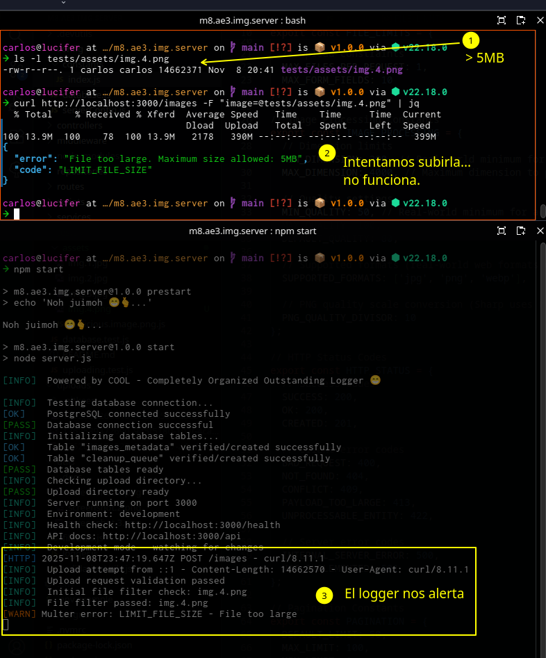

# M8.AE3 Subiendo imágenes con multer.

*Porque "entrete" nunca es malo, y siempre es bueno.*

**Por:**   
- Carlos Pizarro Morales.   
...(hay espacio para tí, oe!!)   
...(ya po. te decidiste??)

## KATHYYYYY !!

Si estás leyendo esto es porque no he terminado la documentación o los tests. En este momento el proyecto está funcional y supera ampliamente los requerimientos, aunque he tomado decisiones sobre algunos de los requisitos. Si quieres, me avisas y completo y/o pusheo lo que falte y lo podrás revisar en un rato o 1 día máx., o bien puedes testearlo tal como está. Insisto: está completo y funcional para lo que se pide:

1. Sube imágenes
2. Borra imágenes
3. Permite usar `sharp` para modificarlas.

## TOC

- [**CONTEXTO**](#contexto)
- [**INSTRUCCIONES**](#instrucciones) - Los requerimientos originales
- [**NOTAS**](#notas) - Mis notas personales, *cómos, por qués*, etc.
    - [**Introducción**](#introducción) - Overview, decisiones y patrones arquitectónicos
    - [**Sobre el flujo de la aplicación**](#sobre-el-flujo-de-la-aplicación) - Endpoints principales
    - [**Sobre el renombrado**](#sobre-el-renombrado) - Criterio de renombrado (distinto al sugerido)
    - [**Sobre el uso de bd**](#sobre-el-uso-de-una-bd) - Una base de datos: por qué, para qué.
    - [**Sobre las validaciones**](#sobre-las-validaciones) - Validaciones realizadas
    - [**Sobre el uso de `sharp`**](#sobre-el-uso-de-sharp) - Cómo se ha utilizado.
- [**FLUJO DE IMPLEMENTACIÓN**](#flujo-de-implementación) - El paso a paso general.
    - [**Primera jornada**](#primera-jornada)
    - [**Segunda jornada**](#segunda-jornada)
- [**CÓMO UTILIZAR**](#cómo-utilizar) - Cómo instalar, utilizar y testear este proyecto.
    - [**Instalación**](#instalar-e-iniciar-el-proyecto) - Instalar e iniciar el proyecto.
    - [**Endpoints**](#endpoints-disponibles) - El listado de todos los endpoints disponibles como oneliners.
    - [**Ejemplos**](#ejemplos-de-uso) - Ejemplos básicos de uso de los endpoints principales.


## Contexto

En este ejercicio grupal, el equipo desarrollará una aplicación Express avanzada para manejar la carga, validación y gestión de archivos. Además de las funcionalidades básicas de carga y eliminación, los participantes implementarán características como renombrar archivos, realizar transformaciones sobre ellos y manejar errores de manera avanzada.

## Instrucciones

### 1. Configuración e Instalación

- Cada equipo debe crear un nuevo proyecto Node.js con el comando `npm init -y`.
- Instalen las dependencias necesarias.
- Configuren la aplicación Express en un archivo principal (`server.js` o index.js).

### 2. Creación de la aplicación para subir archivos

- Implementen una ruta `POST /upload` que permita a los usuarios cargar archivos al servidor. Los archivos deben ser guardados en una carpeta denominada `/uploads`.

### 3. Validación avanzada de existencia del archivo

- Antes de recibir un archivo, deben verificar si ya existe un archivo con el mismo nombre en la carpeta de destino. Si el archivo ya existe, deben agregar un sufijo único (como un número secuencial) o una marca de tiempo al nombre del archivo antes de guardarlo.

> NOTA: Esto no se implementará porque se realizará un manejo más simpático. Ver [notas](#notas).

### 4. Validación de formatos de archivo y tamaños

- Los archivos deben cumplir con ciertos requisitos:
    - Las extensiones permitidas deben ser `.jpg`, `.png`, `.gif`, `.pdf`, `.txt`.
    - El tamaño máximo del archivo debe ser de 5 MB.
- Si el archivo no cumple con estos criterios, debe devolver un mensaje de error adecuado, indicando cuál es el problema (extensión no permitida o tamaño excedido).
- Validación adicional personal: utilizar una librería para verificar el MIME type y que no te *pasen gato por liebre*. Por ejemplo `mime-types`.

### 5. Transformación y modificación del archivo

- Implementen una funcionalidad adicional para los archivos de imagen: si el archivo subido es una imagen `.jpg` o `.png`, el servidor debe realizar una transformación, como cambiar su tamaño o convertirla a otro formato (por ejemplo, convertir `.jpg` a `.png`).
- Pueden utilizar una librería como `sharp`. Investiguen cómo utilizar dicho paquete.

### 6. Renombrado del archivo de manera inteligente

- Los archivos deben ser renombrados antes de ser almacenados en el servidor. Los nombres deben ser únicos y pueden incluir el nombre original con un prefijo o sufijo para evitar colisiones.
- Asegúrese de que los nombres de archivo sean legibles y consistentes.

### 7. Obtención de atributos del archivo y mensajes personalizados

- Después de cargar un archivo, deben extraer sus atributos como:
  - El tipo de archivo (mimetype).
  - El tamaño del archivo (size).
  - El nombre original del archivo.

> NOTA: ver [notas](#notas) de implementación sobre este punto.

Estos atributos deben ser enviados al cliente en una respuesta JSON junto con el mensaje de estado, indicando si el archivo fue subido exitosamente o si hubo algún error.

### 8. Eliminación de archivos del servidor

- Crear una ruta `DELETE /delete/:filename` que permita eliminar un archivo en base a su nombre.
- Si el archivo no existe, responder con un mensaje de error adecuado. Si la eliminación es exitosa, devolver un mensaje de éxito.

### 9. Manejo avanzado de errores

- Deben implementar un manejo de errores adecuado en cada ruta. Si ocurre un error durante la carga, el renombrado o la eliminación del archivo, el servidor debe responder con un código de estado adecuado y un mensaje explicativo.

- Por ejemplo, si el archivo excede el tamaño permitido, deben devolver un error 413 (Payload Too Large) con un mensaje claro.
- Manejar otros códigos de respuesta para diferentes errores.

### 10. Pruebas grupales y optimización

- El equipo debe realizar pruebas exhaustivas de la funcionalidad, especialmente en casos de límite, como el tamaño del archivo, los tipos no permitidos, y la carga de archivos con nombres duplicados.
- Proporcione documentación y ejemplos de cómo utilizar la API de carga de archivos.

## Notas

### Introducción

Este ejercicio ha servido para incrementar en las buenas prácticas adquiridas hasta ahora. Se han realizado cambios en los requerimientos donde no tenían sentido o donde no están de acuerdo con los patrones aprendidos hasta ahora para el desarrollo de buenas APIs. Algunos detalles: 

1. Se han implementado solo endpoints REST y asi `POST /uploads` y `DELETE /delete/:filename` se han transformado en `POST /images` y `DELETE /images/:filename` respectivamente. 
2. Se ha implementado un renombrado más sofisticado haciendo uso de una base de datos para almancenar metadata. Esta decisión no se trata de hacer un *overkill* del proyecto, sino más bien de comenzar a practicar patrones de calidad en cualquier cosa por mínima que sea, si se da la ocasión.
3. Tiene documentación exhaustiva del proceso de implementación y uso.
4. Aun no tiene frontend (no se si me interesa por ahora).
5. Utiliza patrones arquitectónicos como SRP, Dead Letter Queue [(DLQ)](https://aws.amazon.com/what-is/dead-letter-queue/), [Saga](https://learn.microsoft.com/en-us/azure/architecture/patterns/saga) Pattern, [Eventual Consistency](https://systemdesign.one/consistency-patterns/#eventual-consistency), [DAO](https://devcookies.medium.com/dao-design-pattern-the-complete-guide-f8246f227091), etc. y otros micropatrones para practicar código de calidad. No explico en detalle los patrones utilizados en este ejercicio porque sería muy largo y quedan como documentación personal.

### Sobre el flujo de la aplicación

#### POST /upload

**Renombraré este endpoint por** `POST /images` para ser más fiel a lo aprendido hasta ahora. La práctica de utilizar acciones en los endpoints podría sugerir una api bajo el modelo RPC pero no es lo que quiero lograr o explorar por ahora.

1. Un usuario sube una imagen a este servidor.
2. Se capturan sus datos para realizar las validaciones: MIME type, tamaño, extensión, nombre (original).
3. Se realizan las validaciones de MIME type, tamaño y extensiones permitidas.
4. **CASO ESPECIAL**: Si la extensión es válida pero no concuerda con el MIME type, se rechaza la subida con el mensaje "*¿Te creí hacker acaso?*" en JSON y error 
5. Si pasa las validaciones de MIME type, extensión y tamaño, se genera el nuevo nombre (ver [abajo](#sobre-el-renombrado)) y se procede a almacenar el archivo en el directorio `/uploads`
6. Si no pasa las validaciones, se envía el error correspondiente en la `response`. 
7. Si la operación de escritura fue exitosa, se procede a crear un query para la base de datos que contiene:
    - el nombre interno del archivo (`name`).
    - el nombre original (`mask_name`)
    - la ruta relativa (`path`)
    - el MIME type obtenido de la firma del archivo (número mágico) (`mime`)
    - el tamaño del archivo en bytes (`size`)
8. Si la escritura no fue exitosa, se envía el código de error correspondiente.
9. Se envía la query y si la operación de registro es exitosa, se culmina con la respuesta al cliente.
10. Si la query falla en almacenarse en la bd, se elimina el archivo `fs.unlink()` y se envía la respuesta al cliente.

#### DELETE /delete/:filename

**Renombraré este endpoint por** `DELETE /images/:filename`, por los mismos motivos anteriores.

Este método estará implementado de forma limpia en un botón de eliminar con el evento `'click'` asociado al handler `deleteImg(event)`. Este capturará el nombre real del archivo de un atributo `data-name="..."` en el botón y lo enviará bajo el método correcto usando `fetch`. El proceso en el servidor seguirá el mismo patrón "trasaccional" de la creación:

1. El servidor recibe la request.
2. Se procede a buscar el nombre. Si no existe, enviar el error correspondiente en la `response`.
3. Si el archivo existe, crear la query para eliminar el registro de la bd. Mantener los datos en un objeto por si es necesario hacer *rollback* del proceso.
4. Se envía la query y si su resultado es exitoso, se procede con el punto 6.
5. Si la query no fue exitosa, se envía el error en la `response`.
6. La query fue exitosa, por lo que ahora toca eliminar `fs.unlink()` el archivo.
7. Si se elimina exitosamente, se envía la response al cliente.
8. Si no se logra eliminar el archivo, se crea una query para volver a guardar el registro y esta parte es tricky:
    1. Si la query es exitosa, se envía el código de error interno correspondiente al usario.
    2. Pero si no, estamos en un escenario de inconsistencia en la integridad de datos por lo tanto:
    3. Se utiliza una segunda tabla "cleanup_queue" que registra solo `name` el nombre real del archivo inconsistente un timestamp del fallo.
    4. Se retorna un error 500 al usuario, y se le advierte un fallo crítico en el sistema.
    5. Se crea un proceso separado que corre bajo un `cron` o `setInterval` para intentar eliminar constantemente los archivos en esa tabla.

### Sobre el renombrado

El renombrado consiste en eliminar completamente el nombre original del archivo, reemplazándolo por la string que resulta de combinar el timestamp de creación del nombre (`Date.now()`) y un `UUIDv4`. Este nombre estará linkeado en la base de datos con su metadata y nombre original para enviarlo al cliente y ser utilizado en la vista si es requerido. La idea es mantener un nombre completamente consistente.

### Sobre el uso de una BD. 

El aspecto más relevante de las diferencias en mi implementación es que he decidido utilizar una pequeña base de datos (m8_img_server) para manejar los nombres de archivo. Esta contiene dos tablas con los siguientes campos:

#### images_metadata

1. `name` (VARCHAR) combinación de `timestamp + uuid` generado en el servidor antes de almacenar. `PK`
2. `mask_name`: el nombre original que será servido al cliente para utilizar en el frontend.
3. `path`: una ruta relativa (`/uploads` siempre al principio) que permitirá formar la ruta relativa completa para ubicar el archivo y que además permitiría mejorar la organizacion de las imágenes eventualmente (`uploads/user_nn`) por ejemplo.
4. `mime`: el mime type obtenido con `mime-types` (la extensión NO ES un MIME type).
5. `size`: el tamaño del archivo en bytes. 
6. `createdAt` para el registro interno de la base de datos.


#### cleanup_queue

Tabla para almacenar los borrados en estado inconsistente. Probablemente tendrá muy pocos registros idealmente nunca y serán monitoreados por un proceso regular que intentará eliminar los archivos si aún existen.

1. `name` el mismo `name` de la tabla `images_metadata`
2. `fail_time` timestamp del error en el borrado.
3. `delete_state` success/failed para intentos repetidos posteriores.

- No se eliminarán los registros, solo se cambiará su estado en delete_state.
- Otro proceso, **fuera del scope de este proyecto**, respaldará y truncará esta tabla para comenzar limpio con la frecuencia que la lógica de ese proceso indique (tiempo/almacenamiento).

### Sobre las validaciones

Las validaciones son un poco más complejas de lo que propone el ejercicio, utilizando el paquete `mime-type` para descubrir el verdadero **MIME type** de cada archivo, y compararlo con lo declarado. Si estos no coinciden, el servidor responde *como los víoh* al intento malicioso:


Se ha intentado seguir el principio: **no confies en el usuario, no confíes en el browser** del que puedes leer más [**acá**](https://cheatsheetseries.owasp.org/cheatsheets/File_Upload_Cheat_Sheet.html). Por lo demás, se han cubierto las otras validaciones sugeridas cuando no entran en conflicto con la implementación (no se validado que el nombre existe porque el sistema nunca utiliza el nombre original para nada internamente, solo como metadata)

Otra cosa, es que cambié el tamaño máximo de imagen a 3MB porque es un poco difícil buscar imágenes en la web de ese tamaño, y weno, por que si, es mi proyecto. 😅

### Sobre el uso de sharp

Los requisitos no indican bien cómo implementar la utilización de `sharp` así que se decidido lo siguiente:

1. Es un opt-in en `POST /images` a través de query params.
2. Los parámetros disponibles son:
    - `type` o `convert`: Convierte la imagen al formato elegido
    - `size`: para modificar las dimensiones .Mira [endpoints disponibles](#endpoints-disponibles) por más detalles.
    - `quality`: para configurar la calidad.
3. Los parámetros tienen valores fijos o mínimos según el parámetro:
    - `type` | `convert`: **Una entre** png, jpg, webp
    - `size`: el mínimo aceptado es 200x200
    - `quality`: el mínimo aceptado es 50

## Flujo de implementación

### Primera jornada

```bash
# Crea el entorno
mkdir m8.ae3.fileupload
cd m8.ae3.fileupload
touch README.md

# Inicia el proyeto. No seas floj@, no uses -y
npm init

# Instala dependencias.
npm install express multer sharp pg dotenv uuid mime-types

# Crea la BD
sudo -i -u postgres
psql
# CREATE DATABASE m8_img_server [WITH OWNER=you];
# \q
exit

# Crea la estructura base
touch server.js
mkdir controllers routes config uploads utils .devutils

# Comencemos con git
git init
touch .gitignore

# Crea un archivo .gitkeep en /uploads (nuevo para mi)
touch uploads/.gitkeep 

# Creemos el .env para la BD
touch .env
cp .env .env.example

# Initial configs
touch database.js
touch serverConfig.js

# Initial testing
mkdir tests
touch tests/database.test.js
touch README.md

# Also create an entry in package.json
# "scripts": { ..., "db:init": "node tests/database.test.js", ... }
npm run db:init

# Revisamos que de verdad el test hizo lo que dice que hizo.
# Crítico en el primer trip para no hacer tests alucinatorios.
sudo -u postgres psql m8_img_server -c "\dt+"

# Ahora nos volvemos monos 🐒🐵 Let's go nuts!...
touch /controllers/middlewareControllers.js
touch /controllers/rootControllers.js
touch /routes/imageRoutes.js

# Un juguete hermoso para reciclar..
touch /utils/logger.js

# Mejoras e integración logger+npm scripts
mkdir /scripts
touch /scripts/{restart.js, status.js, stop.js}

# Se agregan entradas en package.json::scripts
# Además me volví mono aprendiendo un poco sobre
# otros scripts así que esta entrada ahora tiene:
# prestart test test:db db:init dev start stop restart status
```

### Segunda jornada

Actualmente me queda pendiente de implementar:   

- POST /images - Ahora devuelve 501 "Not yet implemented"
- DELETE /images/:filename - Retorna 501 "Not yet implemented"
- Multer config y manejo de la subida de archivos
- Validación de archivos (MIME type, size, extensions)
- Verificación de la firma del archivo: ("¿Te creí hacker acaso?")
- Generación del nombre (timestamp + UUID)
- Operaciones transaccionales filesystem<>database. La parte más tricky y entrete.
- Uso de `sharp` para transformar las imágenes.

😅 Basicamente: toda la lógica importante...   

Voy a seguir con la implementación de un projecto por capas, siguiendo el modelo **SRP** (Single Responsibility Principle) y un poco parecido a como lo maneja Java porque me parece mucho más limpio e intuitivo para entender qué hace cada parte comparado con los `controllers` aprendidos utilizando Express. No estoy seguro de que el actual sea un modelo "definitivo" con el que crear mis proyectos personales, pero es un ejercicio importante de exploración para mí.

```bash
# Parecido a Java Spring web projects
mkdir services repositories

# Como mi modelo de almacenamiento es transaccional
# y un poco intrincado, separaré en distintos archivos
# la lógica para ver los bugs con claridad. 

# Helpers (services)
cd services
touch FileValidationService.js
touch ImageTransformationService.js
touch FileStorageService.js
touch TransactionService.js

# Repository (conexión con la bd)
cd ../repositories
touch ImageMetadataRepository.js
touch CleanupQueueRepository.js

# El controller más importante.
cd ../controllers
touch ImageController.js

# La configuración de multer. Gemini sugiere
# que esté en su propio directorio en vez de 
# config, aduciendo que las configuraciones de
# /config son más bien estáticas, mientras que
# esta es una configuración de manejo de requests,
# lo que lo hace un archivo "activo". Además, dice
# que es un patrón común en Express.
# Le haré caso mientras me familiarizo con los patrones.
cd ..
mkdir middleware
touch middleware/multerConfig.js

# Finalmente, algunas utilidades
touch utils/fileUtils.js
touch utils/validationUtils.js

# Agrego archivos para que fnm funcione. También descubrí
# que algunos sistemas automatizados de despliegue usan 
# el package.json::engines, así que mejor aún.
touch .nvmrc

# Se ha centralizado la administración de números mágicos
# en /config/constants/index.js para cambiar fácilmente
# cualquier parámetro sin tocar mucho.
mkdir config/constants
touch config/constants/index.js
```

## Cómo utilizar

TODO terminar

### Instalar e iniciar el proyecto

```bash
# Clona el proyecto y navega a su directorio.
git clone []
cd []

# Instala las dependencias
npm install

# Crea la base de datos con usuario dedicado si lo tienes
sudo -u postgres psql -c "CREATE DATABASE m8_img_server WITH OWNER=tu_usuario;"

# o sin usuario dedicado (default postgres)
sudo -u postgres psql -c "CREATE DATABASE m8_img_server;"

# Inicia el proyecto.
npm start
```

### Endpoints disponibles

```bash
# API Endpoints - Image Management  
POST /images
POST /images?convert=jpg
POST /images?convert=png
POST /images?convert=webp
POST /images?resize=200x200
POST /images?resize=200
POST /images?resize=x200
POST /images?quality=50
POST /images?convert=jpg&resize=200x200
POST /images?convert=png&quality=50
POST /images?resize=200x200&quality=50
POST /images?convert=webp&resize=200x200&quality=50

# Image Listing (REST-compliant)
GET /images
GET /images?limit=1
GET /images?offset=0  
GET /images?limit=1&offset=0

# Individual Image Operations
GET /images/:filename
DELETE /images/:filename

# Statistics
GET /images/stats/storage
```

### Ejemplos de uso

#### Subir una imagen:

```bash
# Se supone que estás en el root y usarás la imagen en /tests/assets/
curl http://localhost:3000/images -F "image=@tests/assets/img.1.png" | jq

# O la img.3.jpg y la quieres convertir a webp
curl http://localhost:3000/images?convert=webp -F "image=@tests/assets/img.3.png" | jq
```

**RESULTADO:**  


------

#### Eliminar una imagen:

```bash
curl -X DELETE http://localhost:3000/[filename] | jq
```

**RESULTADO:**  


-----

#### Archivo con MIME disfrazado.

```bash
curl http://localhost:3000/images -F "image=@tests/assets/malicious.image.png.js;filename=malicious.me.png" | jq
```

**RESULTADO:**  


------

#### Subir imagen de más de 5MB:

```bash
# Se supone que estás en el root y usarás la imagen en /tests/assets/
curl http://localhost:3000/images -F "image=@tests/assets/img.4.png" | jq
```

**RESULTADO:**  



ENDPOINTS para verificar

```
# OKAY
# Modern syntax
POST /images?convert=webp&resize=400x400&quality=85

# Minimum valid dimensions
POST /images?resize=200x200

# Minimum valid quality  
POST /images?quality=50

# Combined real-world usage
POST /images?convert=webp&resize=1200x800&quality=75

# ERRORES
# Too small dimensions
POST /images?resize=150x150
# → 400 "Dimensions too small for real-world usage. Minimum dimension: 200px"

# Invalid format
POST /images?convert=bmp  
# → 400 "Invalid format. Allowed formats: jpg, png, webp"

# Quality too low
POST /images?quality=25
# → 400 "Quality too low for real-world usage. Minimum quality: 50%"

# Resize image
curl -F "image=@photo.jpg" "http://localhost:3000/images?resize=800x600"

# Convert format and adjust quality
curl -F "image=@photo.jpg" "http://localhost:3000/images?convert=webp&quality=85"

# Multiple transformations
curl -F "image=@photo.jpg" "http://localhost:3000/images?resize=1200x800&convert=png&quality=95"
```